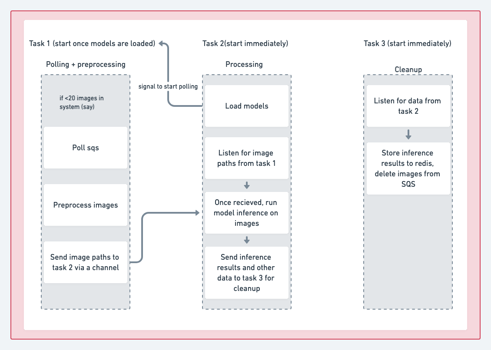
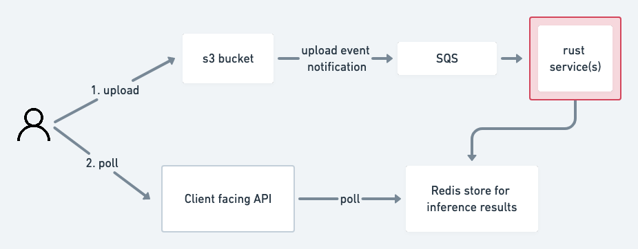
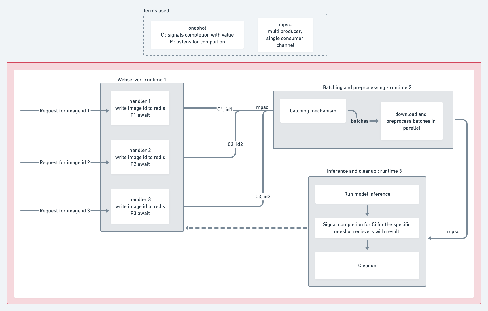
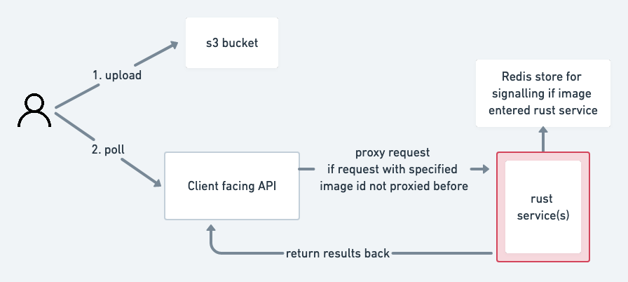

# Introduction to the product FoodDX

## Product intro

[FoodDX](https://www.fooddx.com/) is a service which helps people get insights on how to improve their diet with the help from our proprietary AI technology and personalized feedback from our nutrition experts. In it's current stage, it helps score images of food taken through an app, and gives it a score from 1-5, and also provides personalized tips for the food.

It's a big project with a lot of components - the AI models, the app, and the backend infrastructure which handles it all. We'll be taking a look at the backend in this article.

## Lifecycle of an image

Before we dive into the infrastructure, it would help to take a look at what an image goes through once it enters our system.

- The image is assigned a UUID.
- The image is uploaded to a `s3` bucket.
- The image is then downloaded, preprocessed, run through our models, and a food tip is generated for the image.
- The food tip, inference results and the image hash [^1] form the final response.

## Stack decisions: Rust and haskell

Haskell is used for the client facing API, and it's for other ad-hoc tasks such as reading/writing to a database among others.

Rust is used for image preprocessing, model inference and sending the results back. Sending of results was done differently in the two approaches outlined below. Rust was chosen for it's high efficiency, small executable footprint, and absence of a garbage collector. It also had strong type system, speed & relatively actively maintained Tensorflow (client) library.

# Introduction and pitfalls of the existing architecture

The internal organization of the rust service in this architecture is outlined above.
There were 3 main parts, all running concurrently on 3 separate tokio[^2] runtimes - namely polling sqs, preprocessing and running inference on the images, and cleanup tasks (like writing results to redis, notifying SQS that the image can now be taken off the queue, etc).

The external processes related to this architecture are outlined below.

The main gripe we had was in the `S3` to `SQS`[^3] upload event notification. In our benchmarks, it was [very slow](https://github.com/Holmusk/aws_benchmarks/tree/master/s3_event_to_sqs), and we aim for the service to have a very low latency, with the goal being that every image that comes into the system should be scored/rated in **under 1 second** . Because of the way the system was designed, this meant that we'd need a pretty big makeover on the rust side, and some tweaks on the haskell side if we were to get closer to meeting our performance goals. This is also mentioned in the [AWS docs](https://docs.aws.amazon.com/AmazonS3/latest/userguide/NotificationHowTo.html), where they state that `Typically, event notifications are delivered in seconds but can sometimes take a minute or longer`.

# The new architecture

As mentioned above, the main reason for redesigning the architecture was to avoid the `S3` to `SQS` upload event notification as low latency is of high priority in this project. In the process, we found out that we actually simplified it, by removing unnecessary moving parts.

Internally, the Rust service now also has a [webserver](https://developer.mozilla.org/en-US/docs/Learn/Common_questions/What_is_a_web_server). The client facing API (written in Haskell) proxies the HTTP requests it receives to the Rust server via a load balancer (AWS ELB). In this version of the architecture, we completely eliminate the use of a queue (`SQS`).

## Rust webserver internals

We have chosen to use [`warp`](https://github.com/seanmonstar/warp)[^4] for the web server implementation in Rust.

We have 3 tokio runtimes running simultaneous and somewhat independently of one another. These tokio runtimes communicate with each other using messages that are passed between them using bounded [channels](https://doc.rust-lang.org/book/ch16-02-message-passing.html). The "messages" we pass are custom [`Structs`](https://doc.rust-lang.org/book/ch05-01-defining-structs.html) we define for communication.

Finally, because each request handler needs a result for it's own image, the handler initially creates a [oneshot](https://tokio-rs.github.io/tokio/doc/tokio/sync/oneshot/index.html) for receiving it's results and this is passed along as metadata for the image. Once the image is inferred to in a batch, the data is sent back to the image's corresponding request handler so the results can be returned.

As mentioned, we have completely avoided the use of SQS in this architecture. The external architecture around the rust service now looks like this:

### Types of channels used

We use a couple of different channels for communication with different parts within the rust service. Check out [this chapter](https://doc.rust-lang.org/book/ch16-02-message-passing.html) from the rust book for some more context on how they work!

- [`std::sync::mpsc`](https://doc.rust-lang.org/std/sync/mpsc/index.html) : This is the only `sync` channel we use (rest are `async`). We use it to communicate to the `main` function that the models have been loaded. Since the `main` function is `sync`, we use the builtin synchronous channel rust provides.

The other channels are `async`, meaning they wouldn't block the runtime while `await`ing for a result. They instead would pass the control back to the async runtime (`tokio` in this case) and other tasks can be performed. The `async` channels are :

- [`tokio::sync::oneshot`](https://docs.rs/tokio/1.5.0/tokio/sync/oneshot/index.html) : A oneshot is a channel which has only one reciever and one sender. The handler keeps the `Receiver` and sends it's `Sender` around the program. Once the processing is finished (a batch of requests are processed at a time) the oneshot is used to send the result back to the handler of that specific request, maintaining the one-one mapping of the request and response that's required.
- [`async_channel::bounded`](https://docs.rs/async-channel/1.6.1/async_channel/fn.bounded.html), which we use like a _MPSC_(Multi Producer, Single Consumer) channel to pass data between many response handlers to the batching task, for example. It's used for communication between tasks. We'd like to use `tokio::sync::mpsc`, but :
  - Tokio `1.x` [removed `try_recv`](https://github.com/tokio-rs/tokio/pull/3263) due to some errors. They plan on [adding it back](https://github.com/tokio-rs/tokio/issues/3350) later. This was a function we had to use.
  - `async-channel` is [recommended](https://github.com/tokio-rs/tokio/issues/3350#issuecomment-773952897) as an alternative for the time being.

# Takeaways

These are our takeaways for using Rust in this project!

Pros :

- The Rust community is awesome! A lot of people mention that this is a big strength of the ecosystem, and we fully agree. We found the rust community to be very intelligent, responsive, and friendly when we asked questions on online forums like Reddit and Stackoverflow.
- The Rust book was a great resource. It had a lot of examples and explanations for Rust fundamentals, as well a great insight into multithreading and concurrency.
- It's a little harder to refactor and make huge changes compared to other languages, but it's a worthwhile tradeoff for a critical service in our opinion, as it makes the code more robust. It's also easier to reason with ownership rules once you get the hang of it, compared to compiler magic that some other languages have.

Cons :

- We faced some issues with key libraries not being well maintained. For example, we use AWS, and thus were using the [`rusoto`](https://github.com/rusoto/rusoto) library. Because this library had a dependency with Tokio `0.1.15`, we couldn't migrate to Tokio `1.x` for a really long time. We were able to do it later when `rusoto` was updated, but we still expected such a critical library to stay up to date. Things are looking good however, with AWS announcing that they are [working on an official SDK for Rust](https://aws.amazon.com/blogs/developer/a-new-aws-sdk-for-rust-alpha-launch/).
- It's always a risk upgrading a lot of dependencies in the current state of rust, as you can almost always expect that some inter-dependency compatibility breaks. This was especially magnified in a large project such as this one.

We also have some general takeaways and gotchas we encountered in this project:

- _Tensorflow_ : We found that that the prebuilt tensorflow `C` bindings were not built/available for a large variety of GPU instances we use in AWS. This proved to be a little tedious to fix, as we had to manually compile tensorflow for the systems we use in production, without which we experienced slow inference times and model loading.
- It's pretty hard and largely undocumented how to run ML model inference **in parallel** on GPUs, and we still have not fully explored that option.

---

[^1]: The image hash is calculated and used to check for duplicates.
[^2]: [Tokio](https://tokio.rs/) is an asynchronous runtime for the Rust programming language. A lot of languages have a built in async runtime. Rust allows you to choose whichever runtime you require. Tokio is the most popular option in the Rust ecosystem. Check out [this resource](https://rust-lang.github.io/async-book/08_ecosystem/00_chapter.html) for more insight into async and the rust async ecosystem!
[^3]: Amazon [`SQS`](https://aws.amazon.com/sqs/) is a fully managed queue which we were using to distribute messages to different Rust service instances.
[^4]: We used [`warp`](https://github.com/seanmonstar/warp) because of it's excellent tokio interoperability and flexible [`Filter`](https://docs.rs/warp/0.1.0/warp/trait.Filter.html) system.
